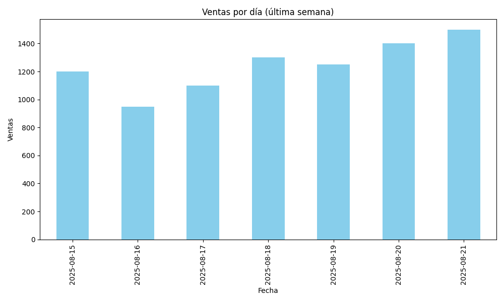

# 🗂️ Automatización de Reportes Semanales

Este proyecto genera reportes semanales en PDF con visualizaciones automáticas a partir de datos de ventas. Ideal para analistas que buscan ahorrar tiempo y mejorar la presentación de resultados.

## 🚀 Tecnologías
- Python
- Pandas
- Matplotlib
- FPDF

## 📊 Funcionalidades
- Limpieza de datos
- Generación de gráficos
- Exportación a PDF
- Automatización semanal

## 🛠️ Cómo usar
1. Cloná el repositorio
2. Instalá dependencias con `pip install -r requirements.txt`
3. Ejecutá `python Reportes.py`

## 📎 Ejemplo de salida

## 📄 PDF generado
Se guarda como `Reporte_Semanal.pdf` con gráficos y resumen de KPIs.

## 👩‍💻 Autor
Andrea Elena Moreno Lamberti – [LinkedIn](https://www.linkedin.com/in/andrea-elena-moreno-lamberti-6ab3a7169/)
